# Proyecto Springboot & Android

Este proyecto consiste en consumir una api de springboot mediante una aplicacion de android

## Primeros Pasos

* Importamos las dependencias de Retrofit que nos permiten cambiar entre objetos JSON y Java.

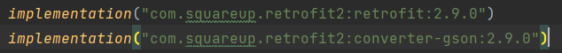

* En nuestro manifest tendremos que añadir los siguientes permisos para conectarnos a la api:

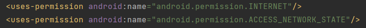

## Estructura de Carpetas

Vamos a crear las siguientes carpetas:

- auth (AuthResponse y LoginRequest)
- dto (UserDTO)
- interfaces(UserInterface)
- model (User)
- retrofitservice (RetrofitService)

- Además crearemos las clases FrameLayout, LoginActivity y RegisterActivity y los Fragmentos DeleteFragment, EditFragment, HomeFragment y ExitFragment. 

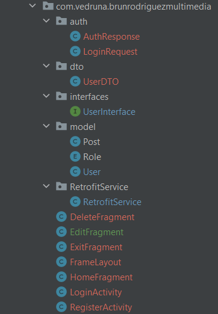

- En la carpeta layout crearemos los archivos xml correspondientes a los mismos.
- menu (bottom_navigation_menu)
- navigation (nav_graph)

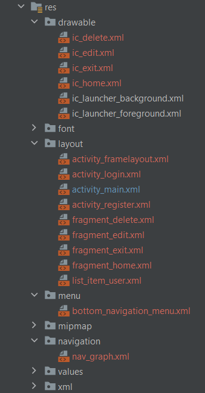

# Comentario

## Registro

La clase RegisterActivity es el Main Intent de la aplicacion. En esta clase encontramos un formulario
que, junto al metodo register de UserInterface, usaremos para registrar nuevos usarios en la base de datos.

Esta clase consta de tres campos de texto (username, password, email, Description).

Usaremos Retrofit para hacer una llamada a la api y registrar el usario siempre y cuando no exista ya 
un usuario con el mismo username o email en la base de datos. 

El resultado de la operacion se le comunicara al usuario mediante Toast.

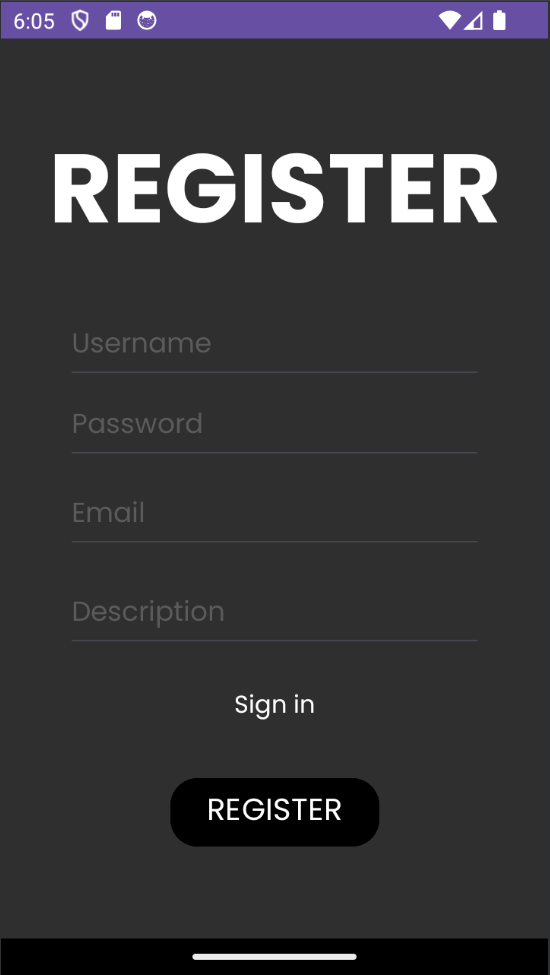

## Login

Tras la creacion del usuario o si ya existiera previamente un usuario en la base de datos se accederia 
a la activity Login. En esta activity usaremos el metodo login de la api que hara una request de inicio de sesión usando el username y password como parametros.

La api requiere de un token de autenticación para realizar las operaciones crud sobre un usario, por lo tanto requiere un inicio de sesión para poder hacer uso de la mayoria de sus métodos.

Cuando el inicio de sesión es correcto se guardara el token en una variable authToken para uso en métodos posteriores y se cambiará a la activity FrameLayout.

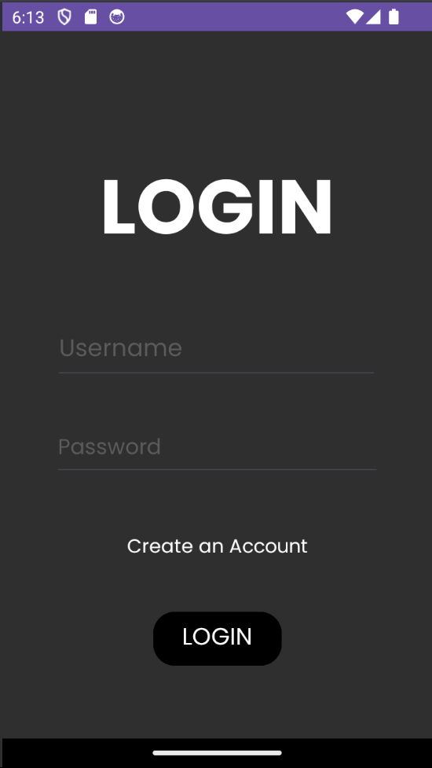

## FrameLayout

El FrameLayout es la actividad principal que nos sirve para navegar entre las distintas opciones de crud. Consta de un Fragment Container que servirá de display para los distintos fragmentos de la aplicación y un BottomNavigationView que nos permitirá movernos entre los mismos.

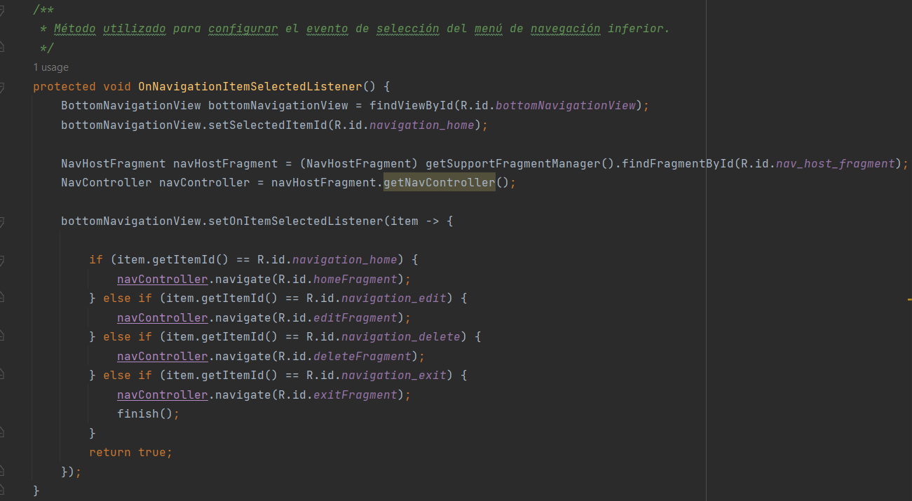

### Bottom Navigation Menu

Consta de 4 Items, uno por cada Fragmento disponible  y vincula los botones de navegación con el navigation_graph y los iconos de iamgenes para botones.

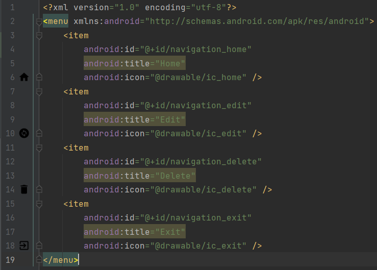

### Navigation Graph

Es el encargado de mapear los botones del menú a los xml correspondientes para permitirnos movernos entre ellos. 

En el implementamos las acciones de movimiento salida-destino entre los distinto fragmentos.

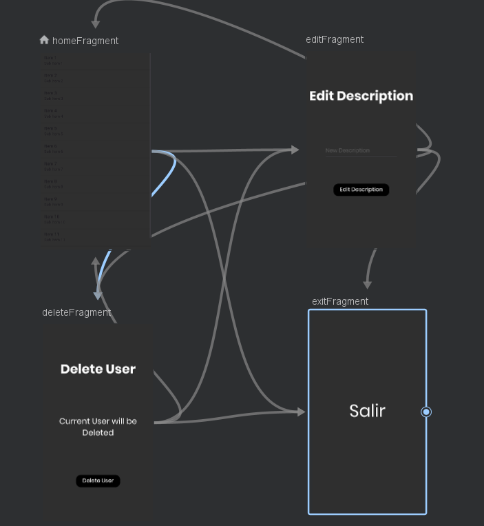

### HomeFragment

El Home Fragment es el fragmento principal del FrameLayout. Al iniciarse usa el método getAllUsers() de UserInterface para hacer un Get de todos los Usuarios en la base de datos. Estos Usuarios se transforman en un DTO para evitar mostrar información no relevante. Tras esto se añadiran todos los usuarios recogidos en un ListView que se enseña por pantalla.

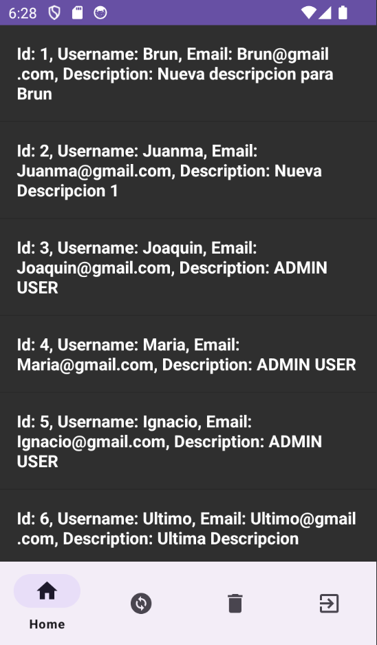

### EditFragment

El Edit Fragment es un fragmento que nos permite cambiar la descripción del Usario Logeado.
Contiene un campo de texto en el que podremos añadir la nueva descripción y un botón que al pulsarlo se llamará al método editDescription de UserService.
Este método requiere el token de autenticación que recibimos antes tras realizar el inicio de sesión y tras verificar el usuario, realizará el cambio de descripción.

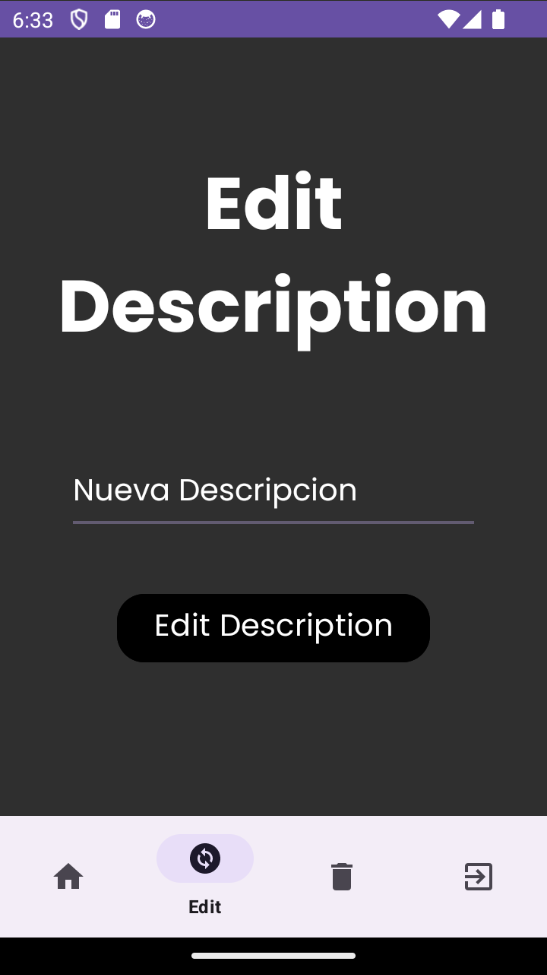

### DeleteFragment

Este Fragment es el encargado de borrar al usuario. Tras ejecutar el método DeleteUser y verificar el usuario con el token, el usuario se borra de la base de datos y se cambia de Activity a la LoginActivity.

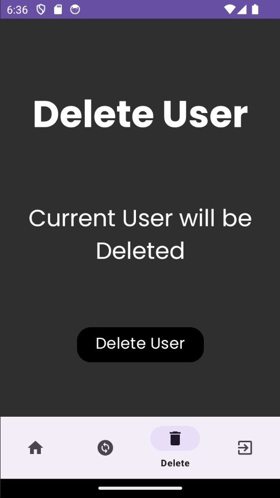

### ExitFragment

Por último, ExitFragment que no tiene elementos visuales, simplemente tras pulsar el botón de navegación correspondiente nos devuelve a la ventana de Login.

